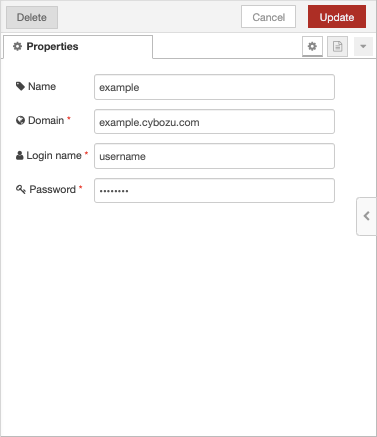
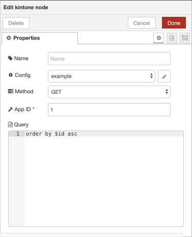

# node-red-contrib-kintone
[Node-RED](http://nodered.org) node that operates [kintone](https://kintone.cybozu.com) records using kintone REST API. 

Support operations are as following:
  * read
  * create
  * update

See http://developer.cybozu.io/ for REST API specs.

## Installation
Manually install:
1. In the directory containing the node’s `package.json file`, run `npm link`
    ```shell
    $ git clone https://github.com/chick-p/node-red-contrib-kintone.git
    $ cd node-red-contrib-kintone
    $ npm link
    ```
2. Restart Node-RED.

Using Node Package Manager:
1. Change to your Node-RED user directory and install this package.
    ```shell
    $ cd ~/.node-red
    $ npm install node-red-contrib-kintone
    ```
2. Restart Node-RED.

## Getting Started

This example that output getting records from kintone.

1. Add a kintone node, edit [Config] and fill properties of your kintone environment.

    

2. Fill request setting.

    

3. Connect to [inject] and [debug] nodes.

    

4. Delopy and Execute. You can get as following JSON format data.
    ```json
    {
      "records": [
        {
          "$id":{"type":"__ID__","value":"1"},
          "$revision": { "type": "__REVISION__", "value": "1" },
          "created at": { "type": "CREATED_TIME", "value": "2019-02-04T00:47:00Z" },
          "updated at": { "type": "UPDATED_TIME", "value": "2019-02-04T00:47:00Z" },
          "name": { "type": "SINGLE_LINE_TEXT", "value": "Taro" }
        },
        {
          "$id":{"type":"__ID__","value":"2"},
          "$revision": { "type": "__REVISION__", "value": "1" },
          "created at": { "type": "CREATED_TIME", "value": "2019-02-04T00:47:00Z" },
          "updated at": { "type": "UPDATED_TIME", "value": "2019-02-04T00:47:00Z" },
          "name": { "type": "SINGLE_LINE_TEXT", "value": "Hanako" }
        }
      ],
      "totalCount": "2"
    }
    ```

## Licence
The MIT License.

Copyright (c) 2019 chick-p

Permission is hereby granted, free of charge, to any person obtaining a copy of this software and associated documentation files (the "Software"), to deal in the Software without restriction, including without limitation the rights to use, copy, modify, merge, publish, distribute, sublicense, and/or sell copies of the Software, and to permit persons to whom the Software is furnished to do so, subject to the following conditions:

The above copyright notice and this permission notice shall be included in all copies or substantial portions of the Software.

THE SOFTWARE IS PROVIDED "AS IS", WITHOUT WARRANTY OF ANY KIND, EXPRESS OR IMPLIED, INCLUDING BUT NOT LIMITED TO THE WARRANTIES OF MERCHANTABILITY, FITNESS FOR A PARTICULAR PURPOSE AND NONINFRINGEMENT. IN NO EVENT SHALL THE AUTHORS OR COPYRIGHT HOLDERS BE LIABLE FOR ANY CLAIM, DAMAGES OR OTHER LIABILITY, WHETHER IN AN ACTION OF CONTRACT, TORT OR OTHERWISE, ARISING FROM, OUT OF OR IN CONNECTION WITH THE SOFTWARE OR THE USE OR OTHER DEALINGS IN THE SOFTWARE.
